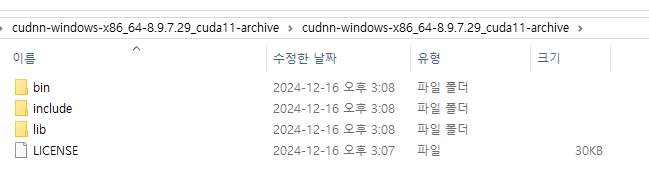
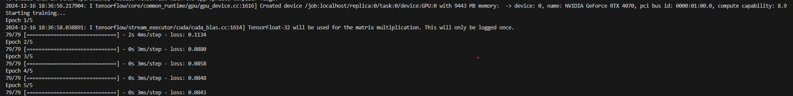

## 1. NVIDIA GPU DRIVER 설치

필자는 Geforce 4060을 사용하고 있어 해당 기준에 맞춰 진행하였습니다.

[DRIVER 설치 링크](https://www.nvidia.com/ko-kr/drivers/) 


위 사진과 같이 설정 후 `NVIDA GPU DRIVER`를 설치합니다.

<BR>

밑 코드를 CMD에서 실행하면 설치가 잘되었는지 확인 가능합니다.
```
nvidia-smi
```

출력 결과


<br>

## 2. CUDA Toolkit 설치

[CUDA Toolkit 버전 호환 확인](https://docs.nvidia.com/cuda/cuda-toolkit-release-notes/index.html)


<br>

python 3.10 에서의 기능개발이 필요했기에 tensorflow 2.10 버전을 택했고 쿠다는 11.2 버전을 다운로드하였다.

[Tensorflow 버전 호환 확인](https://www.tensorflow.org/install/source?hl=ko#gpu)


## 3. CUDNN 설치

[CUDNN 버전 호환 확인](https://developer.nvidia.com/rdp/cudnn-archive)


CUDA 11.2 버전에 맞는 cuDNN 버전을 설치해준다. 11.x 중 하나를 선택하여 다운하면 된다.


밑 CUDA 경로에 다운받은 cuDNN 파일을 옮겨준다. <br>
bin, inclue, lib 폴더를 그대로 드래그 앤 드롭으로 옮겨주면 된다.

```
C:\Program Files\NVIDIA GPU Computing Toolkit\CUDA\v11.2 
```

cuDNN Files




<br>

## 테스트

밑 코드를 통해 GPU가 인식되는지 확인한다.
```python
import tensorflow as tf

print(tf.config.list_physical_devices('GPU'))  # GPU 장치 리스트 출력
print("TensorFlow 버전:", tf.__version__)
```

결과


### 학습코드로 테스트
```python
import tensorflow as tf
from tensorflow.keras.models import Sequential
from tensorflow.keras.layers import Dense
import numpy as np

X = np.random.random((10000, 20))  
y = np.random.random((10000, 1))  

model = Sequential([
    Dense(64, activation='relu', input_shape=(20,)),
    Dense(32, activation='relu'),
    Dense(1)
])

model.compile(optimizer='adam', loss='mse')

print("Starting training...")
model.fit(X, y, epochs=5, batch_size=128)
```

#### 결과


Created device /job:localhost/replica:0/task:0/device:GPU:0 with 9443 MB memory 를 통해 GPU를 감지했다는 것을 알 수 있다.