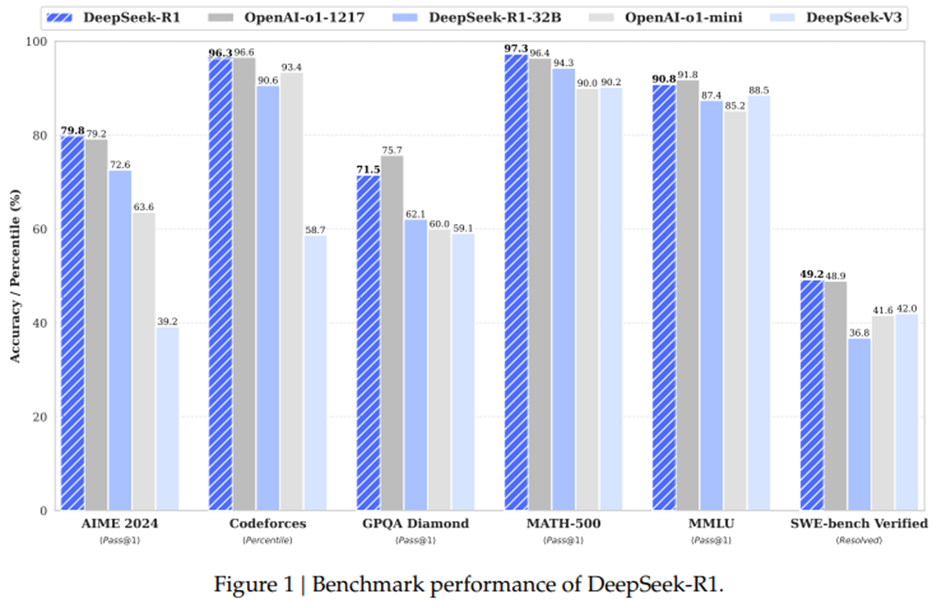

[논문출처 : deepSeek-R1](https://github.com/deepseek-ai/DeepSeek-R1/blob/main/DeepSeek_R1.pdf) 

[논문출처 : deepSeek-V3](https://github.com/deepseek-ai/DeepSeek-V3/blob/main/DeepSeek_V3.pdf)

## DeepSeek-R1

`DeepSeek-R1-Zero`, `DeepSeek-R1`은 지도 학습 기반 미세 조정(SFT) 없이 대규모 강화 학습(RL)만으로 훈련된 모델이며 뛰어난 추론능력을 입증합니다.

강화 학습(RL)을 통해 `DeepSeek-R1-Zero`는 강력하고 흥미로운 여러 가지 추론 능력을 자연스럽게 발현하지만 이는 낮은 가독성이나 언어 혼합과 같은 문제에 직면합니다.

이러한 문제를 해결하고 추론 성능을 더욱 향상시키기 위해 RL 이전에 다단계 학습과 `cold-start-data`를 도입한 `DeepSeek-R1`을 소개합니다.

### DeepSeek-R1과 다른 모델과의 성능 비교

AIME 2024 : 수학 문제 해결 능력 ( 고등수준 ) 
Codeforces : 알고리즘 문제 해결 능력  
GPQA Diamond : 지식 기반 질의응답 능력  
MATH 500 : 수학 문제 해결 능력 ( 대학수준 )  
MMLU : 종합적인 언어 이해력  
SWE-bench Verified : 소프트웨어 개발 및 버그 수정 능력
                              
